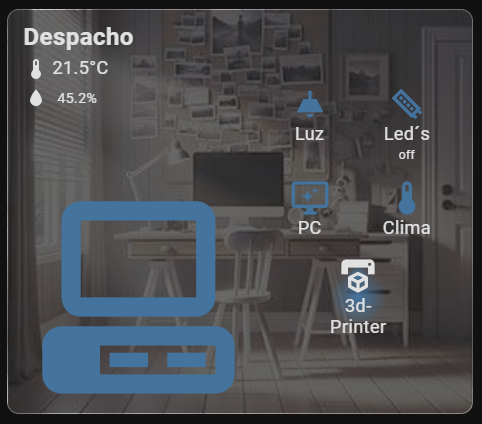
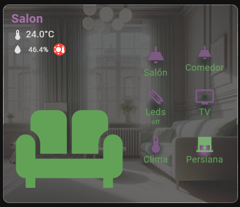
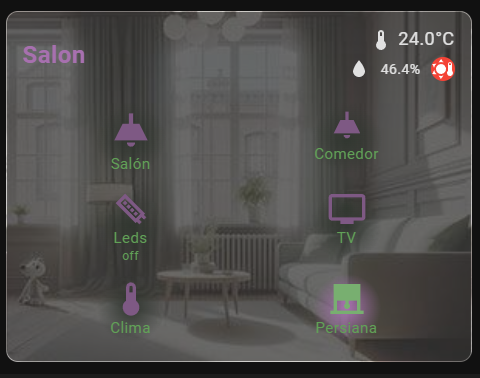
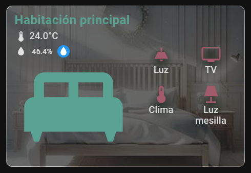

---

# 🏠 **Room Card** - Custom Home Assistant Lovelace Card
[](https://www.home-assistant.io/)
[](https://github.com/usuario/room-card)
[](https://opensource.org/licenses/AGPL-3.0)
[](src/README_es.md))

## 🎨 **Description**

**Room Card** is a customizable card for Home Assistant that allows you to visually monitor the rooms and devices in your home. It supports displaying temperature, humidity, and controlling devices like lights, switches, fans, and more. The card is fully customizable, from colors to icons and backgrounds! 😍

---

## 🚀 **Main Features**

- 📏 **Customizable Sizes**: Adjust the size of icons and text.
- 🎨 **Customizable Colors**: Define text, icon, and background colors.
- 🌡️ **Temperature and Humidity Sensors**: Displays room temperature and humidity.
- 🚪 **Room Icon**: Represent the room with a customizable icon.
- 🖼️ **Dynamic Backgrounds**: Add background images for each room.
- 🛠️ **Simplified Mode**: Simplify the card with fewer controls and a clean view.

---

## 📦 **Installation**

### 🔧 **Manual Installation**

1. Download the `room-card.js` file from [this link](https://github.com/MrEhDev/room-card/blob/main/src/room-card.js).
2. Copy the file to your `config/www/` directory.
3. Add the resource to your Lovelace in `Configuration -> Resources`:

```yaml
resources:
  - url: /local/room-card.js
    type: module
```

4. Restart Home Assistant and add the card to your dashboard.

### 📥 **Installation via HACS**

1. Open HACS in your Home Assistant.
2. Open the menu and click on `Custom repositories`.
3. Add `https://github.com/MrEhDev/room-card`, select `Dashboard` as the type, and click add.
4. Now search for `Room Card` in HACS.
5. Install the card, and you're all set!

---

## 📋 **Basic Configuration**

To add the card to your dashboard, use the following basic configuration:

```yaml
type: custom:room-card
title: Office
background: /local/room-card/img/office.jpg # Custom background image
room_icon: mdi:desktop-classic # Room icon
on_icon_background: 'radial-gradient(circle, #44739e 0%,  transparent 40%)'
room_icon_color: '#44739e'
display_entity: sensor.temp_office # Temperature sensor
display_humidity_sensor: sensor.hum_office # Humidity sensor
display_icon: mdi:thermometer
controls:
  - entity: light.office
    name: Light
    icon: mdi:ceiling-light
    tap_action:
      action: toggle
    show_state: false
  - entity: switch.leds_office
    name: Leds
    icon: mdi:led-strip
  - entity: switch.pc
    name: PC
    show_state: false
    icon: mdi:monitor-shimmer
    tap_action:
      action: toggle
  - entity: climate.office
    name: Climate
    icon: mdi:thermometer
    show_state: false
    tap_action:
      action: more-info
  - entity: switch.3d_printer
    name: 3D Printer
    icon: mdi:printer-3d
    show_state: false
    tap_action:
      action: more-info
```

### 📷 **Screenshot of Basic Example:**



---

## 🌈 **Configuration Options**

Below are all the available options to customize the **Room Card**.

### **Main Attributes:**

| Attribute                | Description                                                                                        | Type      | Default Value           |
|--------------------------|----------------------------------------------------------------------------------------------------|-----------|-------------------------|
| `title`                  | The card's title displayed at the top                                                              | `string`  | `Required`              |
| `title_color`            | Changes the title color                                                                            | `color`   | None                    |
| `background`             | Path to the background image, can be local or remote                                               | `string`  | None                    |
| `simplify`               | When activated, the card is shown in a simplified format without the room icon                     | `boolean` | `false`                 |
| `room_icon`              | The room icon using any Material Design icon                                                       | `string`  | None                    |
| `room_icon_color`        | Color of the room icon                                                                             | `string`  | `var(--primary-text-color)` |
| `sensor_text_color`      | Text color for sensor names and states                                                             | `string`  | `var(--primary-text-color)` |
| `display_entity`         | Temperature sensor to be displayed in the card                                                     | `entity`  | None                    |
| `display_humidity_sensor`| Humidity sensor to be displayed in the card                                                        | `entity`  | None                    |
| `max_temperature`        | Maximum temperature for high-temperature alerts                                                    | `string`  | 26                      |
| `min_temperature`        | Minimum temperature for low-temperature alerts                                                     | `string`  | 18                      |
| `humidity_threshold`     | Humidity threshold for high humidity alerts                                                        | `string`  | 65                      |
| `display_icon`           | Icon to accompany the temperature value                                                            | `mdi:icon`| None                    |
| `icon_size`              | Icon size                                                                                          | `string`  | 40px / 60px             |
| `on_icon_background`     | Background for icons in the "on" state                                                             | `string`  | None                    |
| `off_icon_background`    | Background for icons in the "off" state                                                            | `string`  | None                    |
| `on_color`               | Color for icons in the "on" state                                                                  | `string`  | Default                 |
| `off_color`              | Color for icons in the "off" state                                                                 | `string`  | None                    |
| `show_name`              | Show the name of all control sensors                                                               | `boolean` | `true`                  |
| `show_state`             | Show the state of all control sensors                                                              | `boolean` | `true`                  |
| `sensor_text_color`      | Text color for sensor readings                                                                     | `boolean` | Default                 |

### **Control Attributes (within `controls`):**

| Attribute        | Description                                                                                        | Type      | Default Value         |
|------------------|----------------------------------------------------------------------------------------------------|-----------|-----------------------|
| `entity`         | Entity of the device to be shown as control (lights, switches, etc.)                                | `entity`  | `Required`            |
| `name`           | Name displayed under the control icon                                                               | `string`  | Device Name            |
| `icon`           | The icon representing the control                                                                   | `string`  | None                  |
| `show_name`      | Whether or not to display the control name                                                          | `boolean` | `true`                |
| `show_state`     | Whether or not to display the control state                                                         | `boolean` | `true`                |
| `icon_size`      | Size of the icon in pixels                                                                          | `string`  | `60px` in full mode    |
| `tap_action`     | Behavior when the icon is clicked                                                                   | `string`  | `action: toggle`       |

---

## 🔧 **Advanced Example**

For more advanced customization, you can use the following configuration which demonstrates handling multiple controls and different sensors:

### 📷 **Screenshot of Advanced Example:**

_🔽 Advanced example_



_🔽 Advanced example with *simplify: true*_



---

```yaml
type: custom:room-card
title: Living Room
title_color: '#a770af'
background: /local/room-card/img/living_room.jpg
simplify: true
room_icon: mdi:sofa
room_icon_color: '#61a257'
display_entity: sensor.living_room_temp
display_humidity_sensor: sensor.living_room_humidity
max_temperature: 22
min_temperature: 16
humidity_threshold: 65
display_icon: mdi:thermometer
display_unit: '°C'
icon_size: 40px
on_icon_background: 'radial-gradient(circle, #a770af 0%,  transparent 30%)'
off_icon_background: 'radial-gradient(circle, #313730 0%,  transparent 30%)'
on_color: '#78af70'
off_color: '#7e5984'
show_name: true
show_state: false
sensor_text_color: '#61a257'
controls:
  - entity: switch.living_room_light
    name: Living Room
    icon: mdi:ceiling-light
    icon_size: 50px
    show_name: true
    show_state: false
    tap_action:
      action: toggle
  - entity: switch.dining_room_light
    name: Dining Room
    icon: mdi:ceiling-light
    tap_action:
      action: toggle
  -

 entity: switch.led_strip
    name: Leds
    icon: mdi:led-strip
    show_state: true
  - entity: media_player.sony_tv
    name: TV
    icon: mdi:television
    tap_action:
      action: more-info
  - entity: climate.living_room
    name: Climate
    icon: mdi:thermometer
    show_state: false
    tap_action:
      action: more-info
  - entity: cover.living_room_blinds
    name: Blinds
    icon: mdi:roller-shade
    show_state: false
    tap_action:
      action: more-info
```

_🔽 Other examples_



---

 Yaml:

```yaml
type: custom:room-card
title: Master Bedroom
title_color: '#5aa393'
background: /local/room-card/img/bedroom.jpg
simplify: false
room_icon: mdi:bed-king
room_icon_color: '#5aa393'
display_entity: sensor.master_bedroom_temp
display_humidity_sensor: sensor.master_bedroom_humidity
display_icon: mdi:thermometer
on_icon_background: 'radial-gradient(circle, #a35a6a 0%,  transparent 40%)'
off_icon_background: 'radial-gradient(circle, #313730 0%,  transparent 40%)'
on_color: '#5aa393'
off_color: '#a35a6a'
show_state: false
controls:
  - entity: switch.master_bedroom_light
    icon: mdi:ceiling-light
    name: Light
  - entity: media_player.tv_bedroom
    name: TV
    show_state: false
    icon: mdi:television
    tap_action:
      action: more-info
  - entity: climate.master_bedroom
    name: Climate
    icon: mdi:thermometer
    show_state: false
    tap_action:
      action: more-info
  - entity: light.bedside_lamps
    name: Bedside Lamps
    icon: mdi:lamp
    show_state: false
    tap_action:
      action: more-info
```

---

## 🎨 **Color Customization**

You can fully customize the colors of icons and text using the following options:

```yaml
room_icon_color: '#FF6347'  # Color of the room icon
sensor_text_color: '#FF0000'  # Color of the sensor text (name and state)
```

## 🤝 **Credits and Acknowledgements**

Developed by MrEhDev in collaboration with the [Aguacatec](https://aguacatec.es/) community and based on their [room card](https://aguacatec.es/tarjetas-de-habitacion/).

---

## 📝 **License**

This project is licensed under the AGPL-3.0 License - [View details](LICENSE).

---
