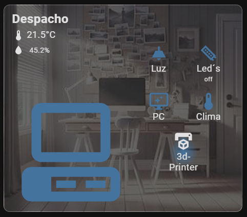
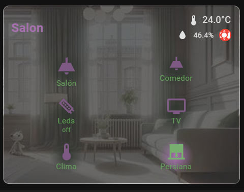

---

# 🏠 **Room Card** - Custom Home Assistant Lovelace Card
[](https://www.home-assistant.io/)
[](https://github.com/usuario/room-card)
[](https://opensource.org/licenses/AGPL-3.0)

## 🎨 **Descripción**

La **Room Card** es una tarjeta personalizable para Home Assistant que te permite monitorizar de forma visual las habitaciones y dispositivos de tu hogar. Con capacidad para mostrar temperatura, humedad y controlar dispositivos como luces, interruptores, ventiladores y más. ¡La tarjeta es completamente personalizable, desde los colores hasta los iconos y fondos! 😍

---

## 🚀 **Características Principales**

- 📏 **Tamaños Personalizables**: Ajusta el tamaño de los iconos y textos.
- 🎨 **Colores Personalizables**: Define colores de texto, iconos y fondo.
- 🌡️ **Sensores de Temperatura y Humedad**: Muestra la temperatura y humedad de la habitación.
- 🚪 **Icono de la Habitación**: Representa la estancia con un icono personalizable.
- 🖼️ **Fondos Dinámicos**: Añade imágenes de fondo para cada habitación.
- 🛠️ **Modo Simplificado**: Simplifica la tarjeta con menos controles y vista limpia.

---

## 📦 **Instalación**

### 🔧 **Instalación Manual**

1. Descarga el archivo `room-card.js` desde [este enlace](https://github.com/usuario/room-card/releases).
2. Copia el archivo en tu directorio `config/www/`.
3. Añade el recurso a tu Lovelace en `Configuración -> Panel de recursos`:

```yaml
resources:
  - url: /local/room-card.js
    type: module
```

4. Reinicia Home Assistant y añade la tarjeta a tu dashboard.

### 📥 **Instalación con HACS**

1. Abre HACS desde tu Home Assistant.
2. Ve a la sección de "Frontend" y busca `Room Card`.
3. Instala la tarjeta y reinicia Home Assistant.
4. Añade el recurso automáticamente desde HACS.

---

## 📋 **Configuración Básica**

Para agregar la tarjeta a tu dashboard, utiliza la siguiente configuración básica:

```yaml
type: custom:room-card
title: Despacho
background: /local/room-card/img/office.jpg # Imagen de fondo personalizada
room_icon: mdi:desktop-classic # Icono de la habitación
on_icon_background: 'radial-gradient(circle, #44739e 0%,  transparent 40%)'
room_icon_color: '#44739e'
display_entity: sensor.temp_office # Sensor de temperatura
display_humidity_sensor: sensor.hum_office # Sensor de humedad
display_icon: mdi:thermometer
controls:
  - entity: light.despacho
    name: Luz
    icon: mdi:ceiling-light
    tap_action:
      action: toggle
    show_state: false
  - entity: switch.leds_office
    name: Led´s
    icon: mdi:led-strip
  - entity: switch.pc
    name: PC
    show_state: false
    icon: mdi:monitor-shimmer
    tap_action:
      action: toggle
  - entity: climate.office
    name: Clima
    icon: mdi:thermometer
    show_state: false
    tap_action:
      action: more-info
  - entity: switch.impresora_3d
    name: 3d-Printer
    icon: mdi:printer-3d
    show_state: false
    tap_action:
      action: more-info

```

### 📷 **Captura de Pantalla del Ejemplo Básico:**




---

## 🌈 **Opciones de Configuración**

A continuación, se detallan todas las opciones disponibles para personalizar la **Room Card**.

### **Atributos Principales:**

| Atributo                  | Descripción                                                                                           | Tipo      | Valor por defecto          |
|---------------------------|-------------------------------------------------------------------------------------------------------|-----------|----------------------------|
| `title`                   | El título de la tarjeta que se mostrará en la parte superior | `string`  | `Obligatorio`|
| `title_color`      | Modifica el color del título | `color`  | Ninguno |
| `background`              | Ruta a la imagen de fondo, puede ser local o remota | `string`  | Ninguno |
| `simplify`                | Si se activa, la tarjeta se mostrará en un formato simplificado sin el room_icon | `boolean` | `false`|
| `room_icon`               | El icono de la habitación, utilizando cualquier icono de Material Design | `string`  | Ninguno  |
| `room_icon_color`         | El color del icono de la habitación| `string`  | `var(--primary-text-color)` |
| `sensor_text_color`       | Color del texto de los nombres y estados de los sensores | `string`  | `var(--primary-text-color)` |
| `display_entity`          | Sensor de temperatura que se mostrará en la pestaña | `entity`  | Ninguno |
| `display_humidity_sensor` | Sensor de humedad que se mostrará en la pestaña | `entity`  | Ninguno  |
| `max_temperature` | Temperatura máxima para que la tarjeta informe de temperatura alta | `string`  | 26  |
| `min_temperature` | Temperatura minima para que la tarjeta informe de temperatura baja | `string`  | 18  |
| `humidity_threshol` | Humbral de humedad para que la tarjeta informe de humedad alta | `string`  | 18  |
| `display_icon` | Icono para acompañar al valor del sensor de temperatura | `mdi:icono`  | Ninguno  |
| `icon_size` | Tamaño de los iconos | `string`  | 40px / 60px  |
| `on_icon_background` | Fondo de los iconos con estado encendido, abierto,.. | `string`  | Ninguno |
| `off_icon_background` | Fondo de los iconos con estado apagado, cerrado,.. | `string`  | Ninguno |
| `on_color` | Color de los iconos con estado encendido, abierto,.. | `string`  | Predefinido |
| `off_color` | Color de los iconos con estado apagado, cerrado,.. | `string`  | Ninguno |
| `show_name` | Muestra el nombre de todos los sensores de control | `boolean`  | `true` |
| `show_state` | Muestra el estado de todos los sensores de control | `boolean` | `true` |
| `sensor_text_color` | Color del texto que muestran los sensores | `boolean`  | Predefinido |


### **Atributos para los Controles (dentro de `controls`):**

| Atributo            | Descripción                                                                                           | Tipo      | Valor por defecto      |
|---------------------|-------------------------------------------------------------------------------------------------------|-----------|------------------------|
| `entity`            | Entidad del dispositivo que se mostrará como control (luces, interruptores, etc.)                      | `entity`  | `Obligatorio`           |
| `name`              | Nombre que se mostrará bajo el icono del control                                                       | `string`  | Nombre del dispositivo  |
| `icon`              | El icono que representará el control                                                                   | `string`  | Ninguno      |
| `show_name`         | Define si se mostrará o no el nombre del control                                                       | `boolean` | `true`                 |
| `show_state`        | Define si se mostrará o no el estado del control                                                       | `boolean` | `true`                 |
| `icon_size`         | Tamaño del icono en píxeles                                                                            | `string`  | `60px` en modo completo |
| `tap_action`        | Comportamiento al pulsar el icono                                                                      | `string`  | `action: toggle` |

---

## 🔧 **Ejemplo Avanzado**

Si quieres personalizar la tarjeta aún más, puedes utilizar la siguiente configuración avanzada que muestra cómo manejar múltiples controles y diferentes sensores:

### 📷 **Captura de Pantalla del Ejemplo Avanzado:**

_🔽 Ejemplo avanzado_


_🔽 Ejemplo avanzado con *simplify: true*_



---

```yaml
type: custom:room-card
title: Salon  # Título que aparecerá en la tarjeta.
title_color: '#a770af' #Color del título
background: /local/room-card/img/salon.jpg  # Imagen de fondo de la tarjeta.
simplify: true  # Si se activa el modo aguacatec, cambia el diseño y distribución de la tarjeta.
room_icon: mdi:sofa  # Ícono principal que representa la habitación.
room_icon_color: '#61a257'  # Color del ícono del room_icon.
display_entity: sensor.termostato_salon_temp  # Entidad para mostrar la temperatura de la habitación.
display_humidity_sensor: sensor.humedad_bano_habitacion_esp  # Entidad opcional para mostrar la humedad.
max_temperature: 22  # Temperatura máxima, mostrará el badge de fuego si se alcanza o supera este valor.
min_temperature: 16  # Temperatura mínima, mostrará el badge de copo de nieve si se iguala o está por debajo de este valor.
humidity_threshold: 65  # Umbral de humedad, mostrará el badge de gota de agua si la humedad iguala o supera este valor.
display_icon: mdi:thermometer  # Ícono que se muestra junto a la temperatura.
display_unit: '°C'  # Unidad de medida para la temperatura (grados centígrados).
icon_size: 40px  # Tamaño global de los íconos de los controles.
on_icon_background: 'radial-gradient(circle, #a770af 0%,  transparent 30%)'  # Fondo del ícono cuando el dispositivo esté encendido.
off_icon_background: 'radial-gradient(circle, #313730 0%,  transparent 30%)'  # Fondo del ícono cuando el dispositivo esté apagado.
on_color: '#78af70'  # Color del ícono cuando el dispositivo esté encendido.
off_color: '#7e5984'  # Color del ícono cuando el dispositivo esté apagado.
show_name: true  # Si es `false`, oculta el nombre de los íconos en los controles.
show_state: false  # Si es `true`, muestra el estado del ícono (encendido/apagado) debajo del ícono.
sensor_text_color: '#61a257' #Color del texto de los sensores
controls:
  - entity: switch.luz_salon  # Entidad de control para la luz principal.
    name: Salón  # Nombre que se mostrará para la luz (si `show_name` está activado).
    icon: mdi:ceiling-light  # Ícono que representa la luz.
    icon_size: 50px  # Tamaño personalizado del ícono de este control específico.
    show_name: true  # Mostrar el nombre de este control, anula el valor global de `show_name`.
    show_state: false  # Mostrar el estado de este control, anula el valor global de `show_state`.
    tap_action:
      action: toggle  # Acción al hacer clic en el ícono (encender/apagar).
  - entity: switch.luz_comedor
    name: Comedor
    icon: mdi:ceiling-light
    tap_action:
      action: toggle
  - entity: switch.sonoff_10006189aa
    name: Leds
    icon: mdi:led-strip
    show_state: true
  - entity: media_player.sony_bravia_tv
    name: TV
    icon: mdi:television
    tap_action:
      action: more-info
  - entity: climate.habitacion_ninos
    name: Clima
    icon: mdi:thermometer
    show_state: false
    tap_action:
      action: more-info
  - entity: cover.persiana_del_salon
    name: Persiana
    icon: mdi:roller-shade
    show_state: false
    tap_action:
      action: more-info

```

_🔽 Otros ejemplos_


---
 Yaml:

```yaml
type: custom:room-card
title: Habitación principal
title_color: '#5aa393'
background: /local/room-card/img/room.jpg
aguacatec: true
room_icon: mdi:bed-king
room_icon_color: '#5aa393'
display_entity: sensor.temp_habitación
display_humidity_sensor: sensor.hum_habitación
display_icon: mdi:thermometer
on_icon_background: 'radial-gradient(circle, #a35a6a 0%,  transparent 40%)'
off_icon_background: 'radial-gradient(circle, #313730 0%,  transparent 40%)'
on_color: '#5aa393'
off_color: '#a35a6a'
show_state: false
controls:
  - entity: switch.int_habitacion
    icon: mdi:ceiling-light
    name: Luz
  - entity: media_player.tv_hab
    name: TV
    show_state: false
    icon: mdi:television
    tap_action:
      action: more-info
  - entity: climate.habitacion
    name: Clima
    icon: mdi:thermometer
    show_state: false
    tap_action:
      action: more-info
  - entity: light.mesillas
    name: Luz mesilla
    icon: mdi:lamp
    show_state: false
    tap_action:
      action: more-info


```


## 🎨 **Personalización de Colores**

Puedes personalizar completamente los colores de los iconos y textos con las siguientes opciones:

```yaml
room_icon_color: '#FF6347'  # Color del icono de la habitación
sensor_text_color: '#FF0000'  # Color del texto de los sensores (nombre y estado)
```
## 🤝 **Créditos y Agradecimientos**
Desarrollado por MrEhDev en colaboración con la comunidad de [Aguacatec](https://aguacatec.es/) y basado en su [tarjeta de habitación](https://aguacatec.es/tarjetas-de-habitacion/)

---


## 📝 **Licencia**

Este proyecto está licenciado bajo la Licencia AGPL-3.0 - [Ver más detalles](LICENSE).

---

